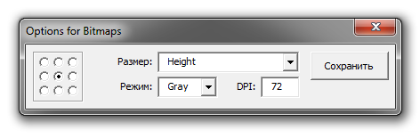

# Расстановка изображений

Дополнительной возможностью макроса, является расстановка растровых изображений. В текущей версии макроса, она работает следующим образом:

* В поле Изображения (Image folder), Вы указываете папку, из которой брать картинки. При этом, имена файлов должны быть указаны в общем файле данных.
* Определяете местоположение и размер, с помощью изображения-метки, по аналогии с текстовыми объектами и штрих-кодами.
* В итоге, макрос расставит все изображения, найденные в указанной папке, и применит все те настройки которые Вы выбрали при определении изображения-метки.

## Настройки:

Когда Вы указываете макросу на изображение, он дополнительно попросит указать какие именно настройки использовать.

В левой части окна настроек выбирается точка отсчёта — относительно какого угла изображение, оно будет выравниваться.

В поле Размер (Size) доступны следующие варианты:

* Original — оригинальный размер изображения
* Width — подгонять (пропорционально) под ширину изображения-метки
* Height — подгонять (пропорционально) под высоту изображения-метки
* Both — подгонять (непропорционально) под ширину и высоту изображения-метки
* Width or Height — вписать (пропорционально) в размеры изображения-метки

В выпадающем списке Режим (Convert to) необходимо указать в какой цветовой режим конвертировать изображение после вставки. А в поле DPI, указать какое разрешение задать изображениям после вставки.
