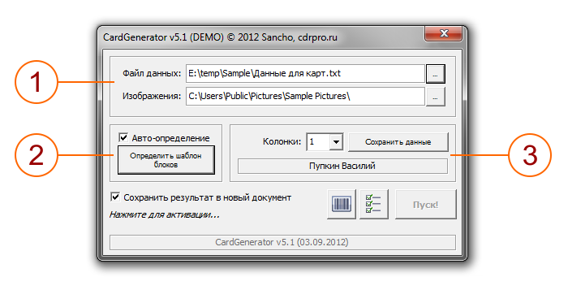
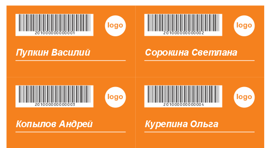

# CardGenerator

Ну вот и настал черёд макроса CardGenerator. Запускаем макрос с помощью команды CardGen.StartCardGenerator.

1. Первое, что нам необходимо — указать, из какого текстового файла необходимо брать данные. Обратите внимание, что абсолютно все переменные данные берутся из указанного файла. Указываем на тот файл, что мы сохранили из Excel, с помощью кнопки справа от поля Файл данных (Data file).

2. Затем, выделяем фоновые прямоугольники (легче всего, в данном случае, это сделать с помощью касательного выделения, зажав клавишу Alt) и нажимаем кнопку Определить шаблон блоков (Determine size and position of blocks). Если Вы всё сделали правильно, макрос покажет нам размер нашего листа, какое кол-во карт располагается на одном листе, а так же, размер одной карточки. Данные указываются в единицах измерения данного документа. Хочу отметить, что все карточки должны быть одного размера!
На данном этапе нам необходимо заблокировать слой Desktop. Это необходимо для того, что бы при создании новых дополнительных страниц, наши «фоновые» объекты не переместились на слой первой страницы. Для того что бы заблокировать слой, достаточно нажать на иконку карандашика напротив необходимого слоя. Только если данные будут генерироваться в текущий документ, а не в новый.

3. Далее необходимо указать макросу какой столбец из файла данных к какому типу объектов привязать. Это одно из нововведений 5-й версии макроса, которое избавляет от нескольких ограничений. Например, вам совсем не обязательно соблюдать порядок столбцов из файла данных, и даже не обязательно задействовать все столбцы. Вы совершенно свободны в выборе в каком порядке и какие столбцы привязать к данным в документе.

Итак, для того чтобы указать макросу какие данные и в каком именно виде он должен их создавать, необходимо сделать следующее (на примере первого столбца):

* Выделяем в документе текстовый объект «ФИО данные» с помощью инструмента Pick tool
* Выбираем из выпадающего списка Колонки (Column of data) первую колонку. При этом в блоке ниже макрос покажет первую строку из этой колонки, и если кликнуть на ней, покажет первые десять строк.
* Нажимаем кнопку Сохранить данные (Anchor selected object)

При этом макрос запомнит всё необходимое оформление и позицию относительно карточки, а так же сообщит, что данные успешно сохранены.

Согласитесь, всё очень просто и понятно — выделяем объект, выбираем колонку данных, и «просим» макрос запомнить. И так с любыми типами данных, будь то картинка, строка, параграф текст или же штрих-код.

После того как Вы указали макросу на все объекты-метки (в нашем случае это были текстовый объект и штрих-код), необходимо удалить их из документа. Это нужно делать только в том случае, если данные будут создаваться в этом же документе.

Для того что бы макрос знал какие именно настройки штрих-кода применять, необходимо нажать кнопку, на которой находится иконка штрих-кода. После её нажатия откроется стандартное окно "Мастер штрих-кода". В этом окне выбираем тип (в нашем случае это CodaBar), число можете ввести любое, т.к. оно ни на что не влияет. С помощью кнопок «Next», укажите все необходимые настройки на всех этапах и в самом конце нажмите «Finish» для того что бы подтвердить настройки и закрыть окно мастера.

Выключите опцию Сахранить результат в новый документ (Generate data into a new document), по причине того что все данные нам необходимо создать в текущем документе. Эту опцию нужно использовать только тогда, когда необходимо сгенерировать всё в новый документ.

Всё!!! Нам остаётся нажать кнопку «Пуск!» и дождаться окончания выполнения работы макроса:

Как видно на изображении выше, макрос взял данные из файла и разместил их согласно тому, как мы указали. Если данных много и все они не входят на одну страницу, макрос будет добавлять страницы и размещать на них данные, пока они не закончатся.
