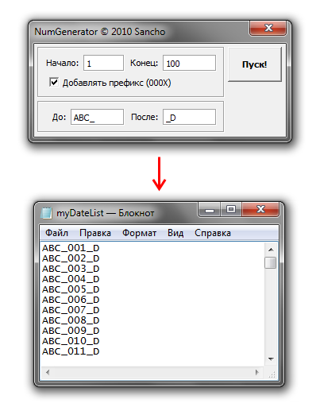

# Генератор нумераций

Также макрос содержит простой генератор нумераций — CardGen.StartNumGenerator.

Описывать его настройки нет смысла. Достаточно взглянуть на изображение ниже, что бы всё стало понятно.

