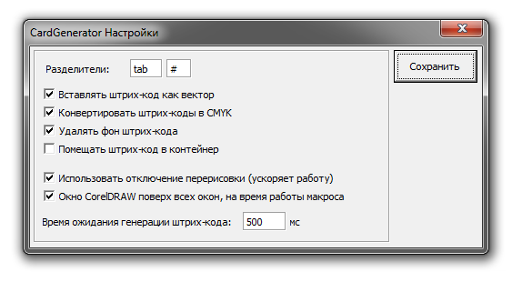
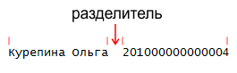
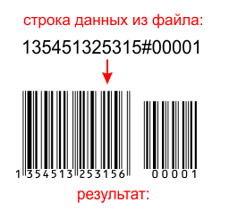

# Настройки макроса

Разделители (Separators). Что бы понять, что такое разделители, необходимо обратиться к описанному выше примеру. Итак, мы знаем, что одна строка — один набор данных. Мы так же помним, что сохраняя данные из Excel, мы использовали тип «Текстовые файлы (с разделителями табуляции)». Так вот, данные внутри строки разделяются непечатным символом табуляции на столбцы.

Ключевое слово «tab» в макросе, эквивалентно символу табуляции.

Второй разделитель понадобится лишь тогда, когда штрих-код будет содержать два значения, например как на изображении ниже.

Остальные настройки:

* Вставлять штрих-код как вектор (Insert barcode as a vector shapes). При включенной опции штрих-код вставляется как группа векторных объектов. Номер штрих-кода, если таковой есть, вставляется как шрифт. Если отключить данную опцию, штрих-код будет вставляться в документ как OLE-объект.
* Конвертировать штрих-коды в CMYK (Convert barcodes to CMYK). Данная опция работает только, если штрих-код вставляется как группа векторных объектов.
* Удалить фон штрих-кода (Remove white background barcode). Удаляет белый фон штрих-кода, оставляя только полоски и текст.
* Помещать штрих-код в контейнер (Put barcodes in PowerClip)
* Использовать отключение перерисовки (Disable Screen Refresh). При включении данной опции, макрос во время работы отключит перерисовку внутри документа. За счёт этого можно значительно ускорить процесс.
* Окно CorelDRAW поверх всех окон, на время работы макроса (Hide macro during processing). Макрос использует стандартное окно мастера штрих-кодов. Поэтому оно будет быстро появляться и исчезать на экране во время работы макроса. Если Вам это не нравится, Вы можете активировать данную опцию, и тогда на время работы, окно CorelDRAW будет перекрывать все остальные окна.
* Время ожидания генерации штрих-кода (Delay Time for barcode generation). К изменению данного параметра следует отнестись весьма осторожно! Суть его в том, что после того, как макрос указывает мастеру какой штрих-код создавать, ему необходимо некоторое кол-во времени для создания. По умолчанию это время составляет половину секунды.
