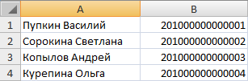
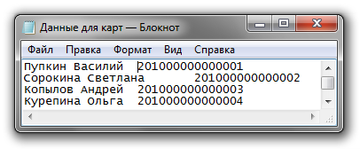

# Подготовка данных

Начнём с того, что необходимые данные, обычно, компания предоставляет сама в виде Excel таблицы в два столбика, плюс образец карты. Это всё, что нам необходимо, так что приступаем к выполнению.

Для начала необходимо экспортировать данные из Excel в обычный текстовый файл. Для этого, открыв таблицу в Excel, выбираем команду «Сохранить как…» и в качестве типа файла указываем «Текстовые файлы (с разделителями табуляции)». После сохранения откроем текстовый файл и проверим результат.

На этом внешняя подготовительная работа завершена.
