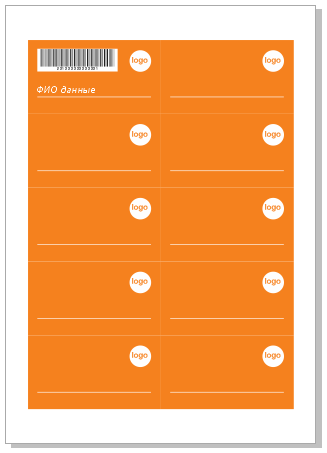
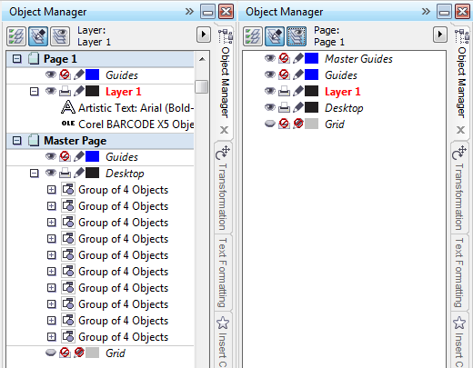

# Шаблон

Открываем шаблон в CorelDRAW. И расставляем карточки так, как нам это необходимо, с помощью докера трансформации. Здесь следует обратить внимание на очень важный момент — переменные данные (штрих-код, ФИО) необходимо оставить только в левой верхней карте. Она послужит нам шаблоном-меткой. В результате у нас должно получиться нечто подобное.

Переменные данные необходимо разместить на слое первой страницы, а всё остальное переместить на мастер-слой Desktop («Рабочий стол»). При этом Desktop должен находится под слоем первой страницы, как показано на правом изображении ниже.

Для того что бы переместить слой Desktop под слой страницы, в менеджере объектов необходимо переключится в режим Layer Manager View (правая крайняя кнопка на верхней панели докера), и просто удерживая нужный нам слой, перетащить его.
Все эти манипуляции со слоями необходимы, что бы не дублировать фон (карточки) на все последующие страницы (только в том случае, если макрос настроен для генерации данных в текущем документе, а не в новом).
Важно: при генерации данных в новый документ, фон можно вставить в специально созданный макросом слой fon мастер страницы. После, слой необходимо обязательно заблокировать от редактирования и убедиться, что его печать разрешена (иконки перед названием слоя в Диспетчере объектов).
